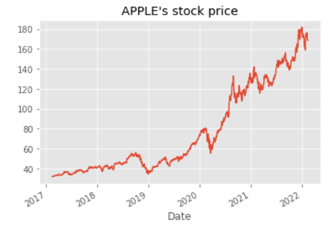

# Capstone
# Stock Analysis

**Author**: Bridget Coleman



## Overview

Historical stock prices were analyzed 

## Business Problem

The market fluctuates.  Is ?????

## Data


The stock prices for Apple and Procter & Gamble are from Yahoo Finance.  It is one year's worth of data.

## Methods

This project tested Time Series Models.     


## Results

The SVD model was the best option.  The predicted rating for a user may be off on average of just under one star on a a scale of .5-5 stars.  

This result was the best out of the three models that were tested.  


## Conclusions and next steps

The models were tested using only two stocks.  The model should be tested on more stocks.  

It would be interesting to see if there are any changes to the results if more than one year of stock prices is used.

The financial statements should also be analyzed.

## For More Information

Please review the full analysis in [my Jupyter Notebook](https://github.com/bkcoleman1024/MovieLens/blob/main/Phase%204%20notebook.pdf) or the [presentation](https://github.com/bkcoleman1024/MovieLens/blob/main/Phase%204%20powerpoint.pdf).

For any additional questions, please contact Bridget Coleman, bkcoleman1024@gmail.com

## Repository Structure


```
├── README.md   
├── Stock_presentation.pdf
├── images            
└── Capstone.ipynb 
