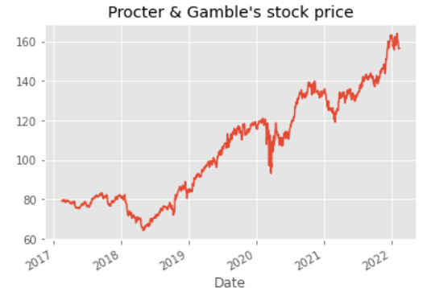

# Capstone
# Stock Analysis

**Author**: Bridget Coleman


## Overview

Historical stock prices were analyzed 

## Business Problem

The market fluctuates.  Is ?????

## Data



The stock prices for Apple and Procter & Gamble are from Yahoo Finance.  It is one year's worth of data.

## Methods

A grid search was used to find the best parameters of p,d, and q.  These parameters were used in the models.   


## Results

The models predicted the increasing prices of the stocks.  


## Conclusions and next steps

The models were tested using only two stocks.  The model should be tested on more stocks.  

It would be interesting to see if there are any changes to the results if more than one year of stock prices is used.

The financial statements should also be analyzed.  

## For More Information

Please review the full analysis in [my Jupyter Notebook](https://github.com/bkcoleman1024/MovieLens/blob/main/Phase%204%20notebook.pdf) or the [presentation](https://github.com/bkcoleman1024/MovieLens/blob/main/Phase%204%20powerpoint.pdf).

For any additional questions, please contact Bridget Coleman, bkcoleman1024@gmail.com

## Repository Structure


```
├── README.md   
├── Stock_presentation.pdf
├── data
├── images            
└── Capstone.ipynb 
